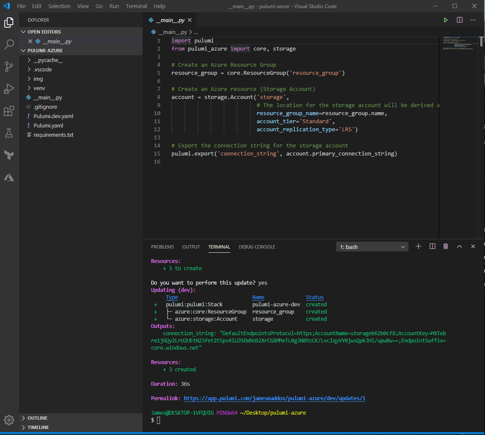
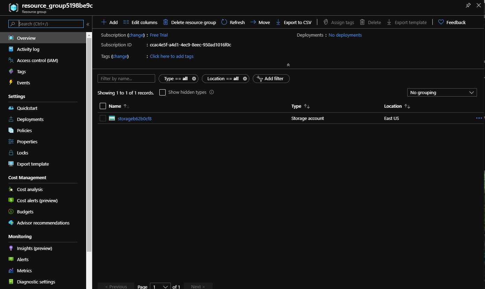

## Pulumi in Azure Demo

I created a very simply Python file to deploy a storage account to Azure using Pulumi

Code showing Python file and push to Azure with Pulumi:  
  
 
Newly created storage account on Azure:  
  
